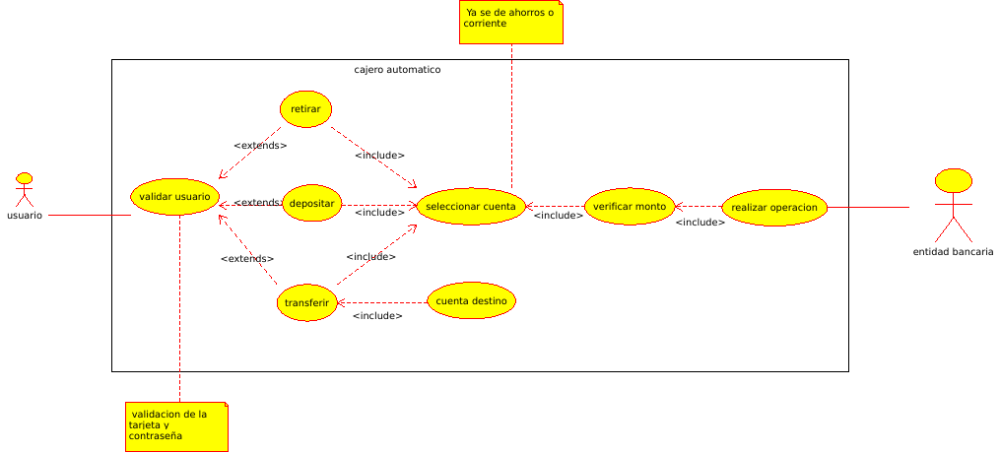
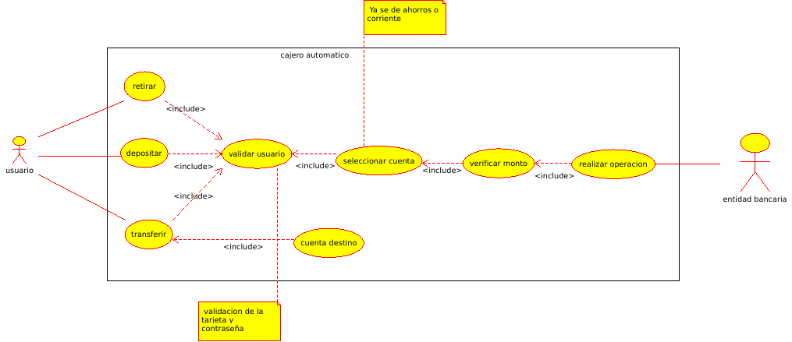
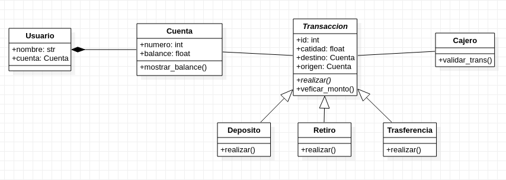

# Diagramas de modelo de cajero

Carlos López Carreño - 20162021295
Programa utilizado: umbrello

---

### Diagrama de casos de uso

##### Primera versión

##### Segunda versión

### Diagrama de clases

